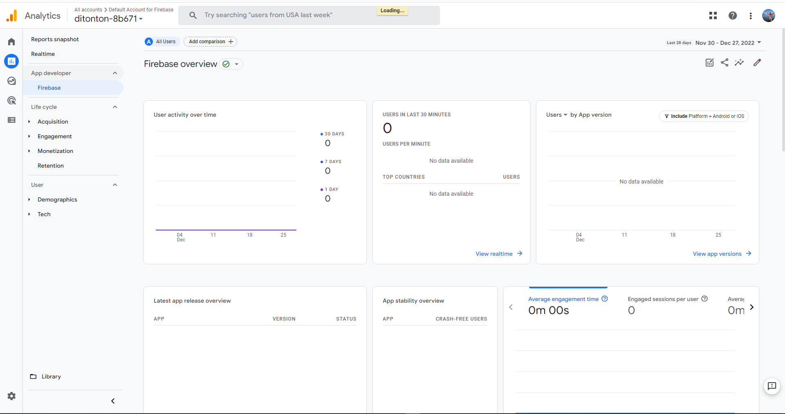

# Hi there, I'm Fradip

## 🔥 CI/CD Status
This below are the build status of code magic builds.

- Trigger on push
- Default workflow
- Machine Mac mini M1

## Built With

## 🎉 Firebase Analytics & Crashlytics
### Analytics

### Analytics

## ✅ Test Coverage

### Movies Coverage

### Tv Series Coverage

### Search Coverage

### Watchlist Coverage

